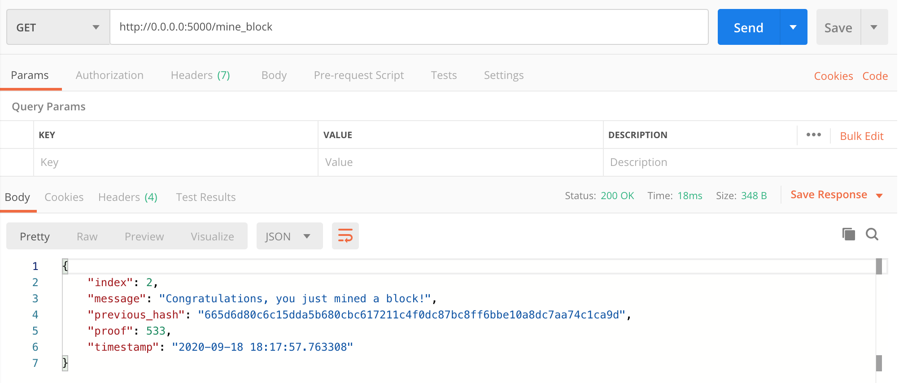
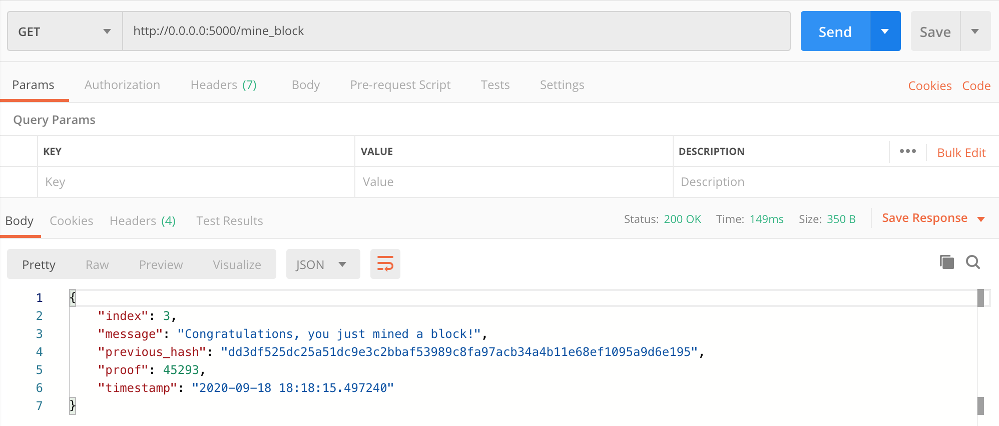
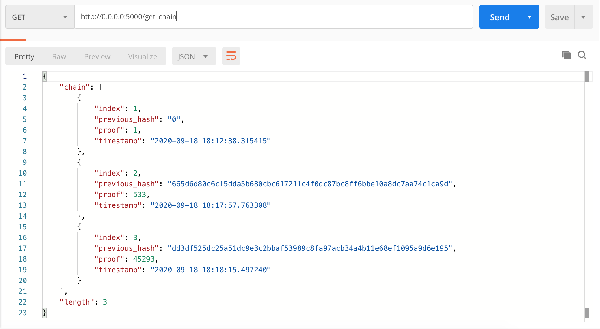
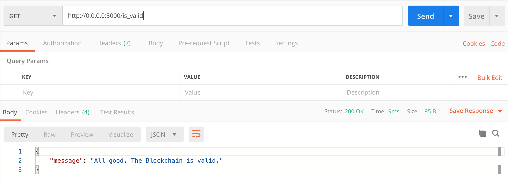

# Flask Blockchain

This project is aimed at creating a demo Blockchain using Python and Flask. To demonstrate this, we have the following three endpoints on Flask:

  - **mine_block** - To mine a new block by performing the necessary proof of work and appending the block to the blockchain
  - **get_chain** - To display the entire blockchain
  - **is_valid** - To check whether or not the blockchain is valid

# Screenshots : 

**1) Mining a block (Genesis block is already present hence this is labeled block number 2** <br><br><br>
 
  <br><br><br>

 **2) Mining another block** <br><br><br>
 
 <br><br><br>
  **3) Printing the entire Blockchain** <br><br><br>

 
  <br><br><br>

  **4) Checking if the Blockchain is Valid** <br><br><br>

 
 <br><br><br>


### Development

Want to run it locally on your machine? Great!

Simply download the project and navigate to the folder containing the blockchain python file.

Open your favorite Terminal and run this command.


```sh
$ python3 blockchain.py
```

Now, you have Flask running on localhost Port 5000 by default, and we can proceed to Postman for using the GET requests.


Verify the deployment by navigating to your server address in your preferred browser.

```sh
0.0.0.0:5000
```


### Todos

 - Create a nice frontend
 - Perform a few tests

License
----

MIT


**Free Software, Hell Yeah!**
